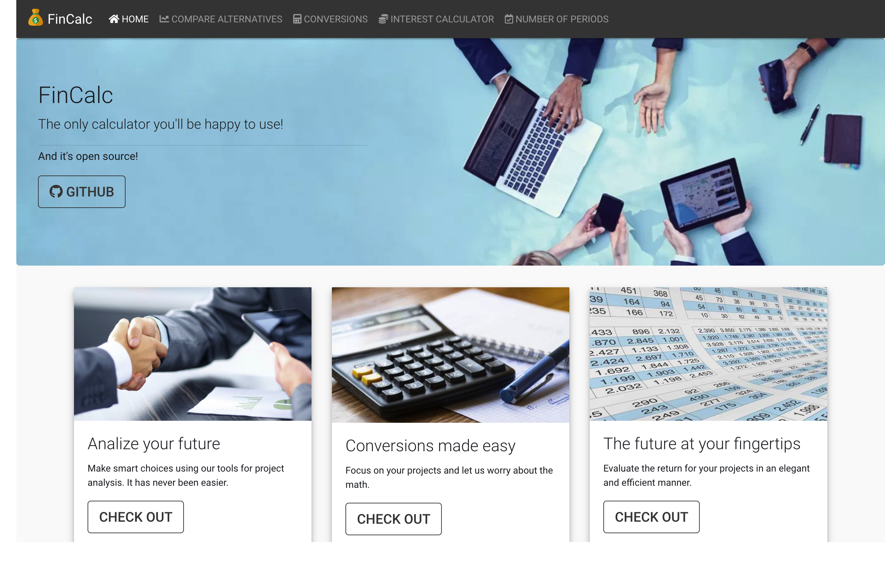

# FinCalc

The only calculator you'll be happy to use.

November, 2018

## About

The calculator allows you to perform the following actions.

* Project evaluation and comparison.
* Interest conversions.
* Return period calculation.
* Present and Future value conversions.  

## Info

The web app was built on top of the following tools.

* python 3.6  
* django 2.1.3  
* numpy
* simplejson
* sqlite

## Contributions

Feel free to contribute through pull requests.